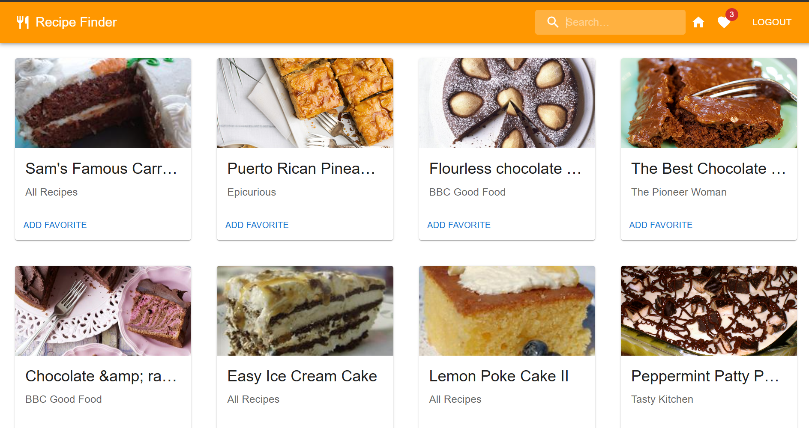

# 🍳 Recipe Finder

A modern, responsive web application that helps users discover and explore recipes from around the world. Built with React.js, Redux, Firebase, and Material-UI, this application provides a seamless recipe searching experience with user authentication and favorites management.



## ✨ Features

### 🔐 Authentication System
- **User Registration** - Create new accounts with email and password
- **Secure Login** - Firebase Authentication integration
- **Google Sign-In** - Quick login with Google accounts
- **Protected Routes** - Secure access to authenticated features
- **Session Management** - Persistent login state

### 🔍 Recipe Discovery
- **Interactive Search Interface** - Browse through categorized food items
- **Wide Recipe Database** - Access to thousands of recipes via Forkify API
- **Smart Search Categories** - Vegetables, fruits, proteins, cuisines, and more
- **Instant Results** - Real-time recipe fetching and display

### 🏠 User Experience
- **Intuitive Navigation** - Clean, modern Material-UI design
- **Recipe Cards** - Beautiful display with images, titles, and publishers
- **Detailed Recipe View** - Complete instructions, ingredients, and cooking time
- **Responsive Design** - Works perfectly on desktop, tablet, and mobile

### ⭐ Favorites Management
- **Save Favorites** - Add recipes to personal favorites collection
- **Favorites Counter** - Real-time badge showing saved recipes count
- **Easy Management** - View and remove favorites with simple clicks
- **Local Storage** - Persistent favorites across sessions

### 🎯 Smart Navigation
- **Home Reset** - One-click return to search categories
- **Breadcrumb Flow** - Clear navigation between search, results, and details
- **Protected Routing** - Automatic redirects for unauthorized access

## 🚀 Getting Started

### Prerequisites
- Node.js (v14.0.0 or higher)
- npm (v6.0.0 or higher)
- Firebase account (for authentication)

### Installation

1. **Clone the repository**
   ```bash
   git clone https://github.com/mahimavarma/MadLabProject.git
   cd Recipe-Finder
   ```

2. **Install dependencies**
   ```bash
   npm install
   ```

3. **Firebase Configuration**
   - Create a Firebase project at [Firebase Console](https://console.firebase.google.com/)
   - Enable Authentication with Email/Password and Google providers
   - Create a Firestore database
   - Copy your Firebase config and update `src/Components/firebase.js`

4. **Start the development server**
   ```bash
   npm start
   ```

5. **Open your browser**
   - Navigate to `http://localhost:3000`
   - The app will automatically reload on code changes

## 📖 Usage

### Getting Started
1. **Register/Login** - Create an account or sign in with existing credentials
2. **Browse Categories** - Explore the home page with various food categories
3. **Search Recipes** - Click on any category (e.g., "chicken", "pasta", "pizza") to find recipes
4. **View Details** - Click on recipe cards to see detailed instructions and ingredients
5. **Save Favorites** - Add recipes you love to your favorites collection
6. **Navigate** - Use the home icon to return to category selection anytime

### Key Navigation
- **🏠 Home Icon** - Returns to search categories page
- **❤️ Favorites** - View your saved recipes with counter badge
- **🔍 Search Bar** - Quick search from the navigation bar
- **🚪 Logout** - Secure logout from your account

## 🛠️ Built With

### Frontend
- **[React.js](https://reactjs.org/)** - Component-based UI library
- **[Redux](https://redux.js.org/)** - State management with Redux Toolkit
- **[Material-UI](https://mui.com/)** - Modern React component library
- **[React Router](https://reactrouter.com/)** - Client-side routing

### Backend & Services
- **[Firebase Auth](https://firebase.google.com/docs/auth)** - User authentication
- **[Firestore](https://firebase.google.com/docs/firestore)** - NoSQL database
- **[Forkify API](https://forkify-api.herokuapp.com/v2)** - Recipe data source

### Additional Libraries
- **React Toastify** - Beautiful notifications
- **SweetAlert2** - Enhanced alert dialogs
- **Bootstrap** - Additional styling utilities
- **Semantic UI** - Extra UI components

## 📁 Project Structure

```
src/
├── Components/           # React components
│   ├── AuthContext.js   # Authentication context provider
│   ├── Home.js          # Main home page with search categories
│   ├── NavBar.js        # Navigation bar component
│   ├── login.js         # Login form component
│   ├── register.js      # Registration form component
│   ├── SearchList.js    # Food categories display
│   ├── RecipeInstruction.js # Detailed recipe view
│   ├── Favourite.js     # Favorites management
│   ├── ProtectedRoute.js # Route protection wrapper
│   └── firebase.js      # Firebase configuration
├── Redux/               # State management
│   ├── store.js         # Redux store configuration
│   ├── RecipeActions.js # Action creators
│   ├── RecipeReducer.js # State reducers
│   └── RecipeTypes.js   # Action type constants
├── photos/              # Static images
└── App.js               # Main application component
```

## 🔧 Available Scripts

- `npm start` - Runs the development server
- `npm build` - Creates optimized production build
- `npm test` - Launches test runner
- `npm eject` - Ejects from Create React App (irreversible)

## 🚀 Deployment

### Build for Production
```bash
npm run build
```

### Deploy to Firebase Hosting
1. Install Firebase CLI: `npm install -g firebase-tools`
2. Login to Firebase: `firebase login`
3. Initialize hosting: `firebase init hosting`
4. Deploy: `firebase deploy`

### Deploy to Netlify
1. Build the project: `npm run build`
2. Drag and drop the `build` folder to Netlify
3. Configure redirects for React Router in `public/_redirects`:
   ```
   /*    /index.html   200
   ```

## 🌟 Key Features Explained

### Authentication Flow
- Secure user registration and login system
- Protected routes that redirect unauthenticated users
- Persistent login state using Firebase Auth
- Google OAuth integration for quick access

### Recipe Search System
- Category-based search interface with 100+ food items
- Real-time API integration with Forkify recipe database
- Responsive grid layout for optimal viewing
- Detailed recipe pages with cooking instructions

### State Management
- Redux for global state management
- Persistent favorites using localStorage
- Optimized re-renders with proper state structure
- Thunk middleware for async actions

## 🤝 Contributing

We welcome contributions! Please follow these steps:

1. Fork the repository
2. Create a feature branch (`git checkout -b feature/AmazingFeature`)
3. Commit your changes (`git commit -m 'Add some AmazingFeature'`)
4. Push to the branch (`git push origin feature/AmazingFeature`)
5. Open a Pull Request

### Development Guidelines
- Follow React best practices and hooks patterns
- Use Material-UI components for consistency
- Write clear, descriptive commit messages
- Test thoroughly before submitting PRs

## 📝 License

This project is licensed under the MIT License - see the [LICENSE](LICENSE) file for details.

## 👥 Authors

- **Mahima Varma**
- **Ayush Tiwari**
- **Sakshi Said**

## 🙏 Acknowledgments

- [Forkify API](https://forkify-api.herokuapp.com/) for providing recipe data
- [Material-UI](https://mui.com/) for the beautiful component library
- [Firebase](https://firebase.google.com/) for authentication and database services
- Create React App for the initial project setup

## 📞 Support

If you encounter any issues or have questions:

1. Check the [Issues](https://github.com/mahimavarma/MadLabProject/issues) section
2. Create a new issue if your problem isn't already reported
3. Provide detailed information about the issue and steps to reproduce

---

**Happy Cooking! 🍽️**

> Built with ❤️ for food lovers who want to discover amazing recipes from around the world.
